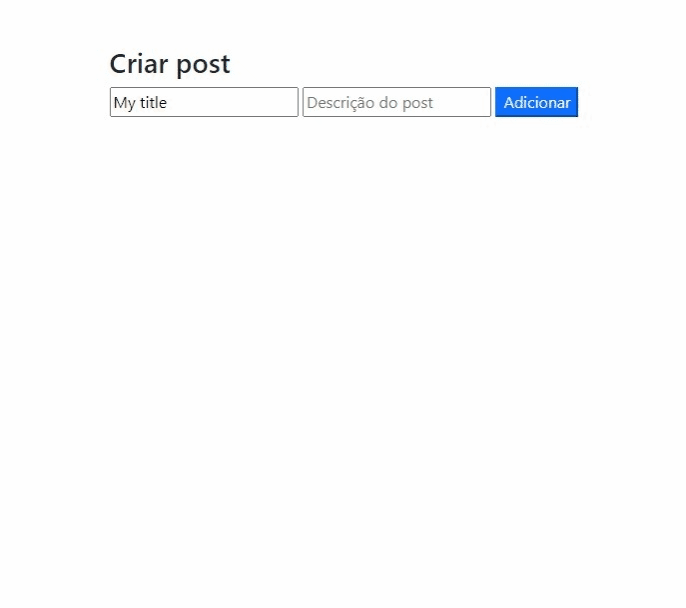

<h1 align="center">Notice Wall - Full Stack</h1>

<h3 align="center">Este projeto foi desenvolvido durante o curso do <a href="http://programadorbr.com">Programador Br</a>, um projeto focado mas no back-end. Ainda está em desenvolvimento, estou implementando algumas funcionalidades extras: testes e melhorias no front-end.</h3>

## Demonstração do projeto 👁‍🗨



<h2 align="center"> 
	🚧  Projeto em desenvolvimento... 🚀   🚧
</h2>

### Pré-requisitos

Antes de começar, você vai precisar ter instalado em sua máquina as seguintes ferramentas:
[Git](https://git-scm.com), [Node.js](https://nodejs.org/en/).
Além disto é bom ter um editor para trabalhar com o código como [VSCode](https://code.visualstudio.com/)

### 🎲 Rodando o Back End (servidor)

```bash
# Clone este repositório
$ git clone <https://github.com/matdevz/NOTICE-WALL.git1>

# Acesse a pasta do projeto no terminal/cmd
$ cd backend

# Instale as dependências
$ npm install || yarn add

# Execute a aplicação em modo de desenvolvimento
$ npm run dev || yarn run dev

# Execute a aplicação em modo de produção
$ npm start || yarn start

# Execute para testar a aplicação
$ npm test || yarn test

# O servidor inciará na porta:3001 - acesse <http://localhost:3001>
```

### 🛠 Tecnologias

As seguintes ferramentas foram usadas na construção do projeto:

-   [Node.js](https://nodejs.org/en/)
-   [Express](https://expressjs.com/pt-br/)
-   [JavaScript](https://www.javascript.com/)
-   [BootStrap](https://getbootstrap.com/)
-   [HTML](https://developer.mozilla.org/pt-BR/docs/Web/HTML)
-   [CORS](https://developer.mozilla.org/pt-BR/docs/Web/HTTP/CORS)
